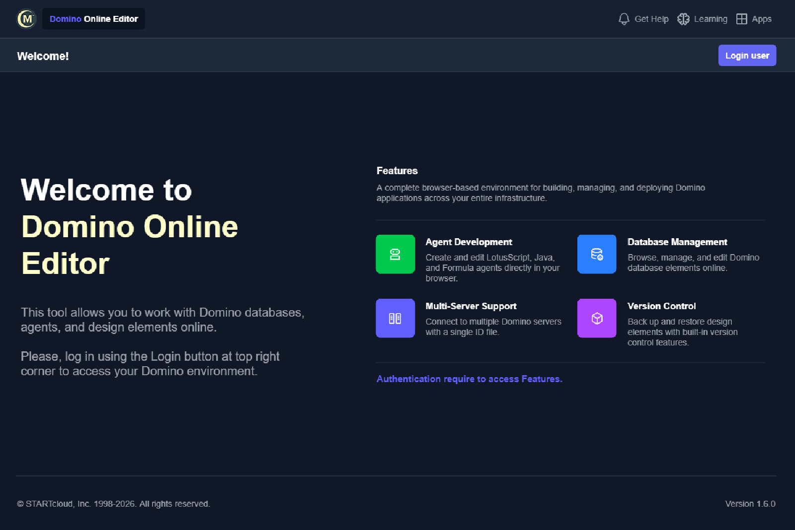
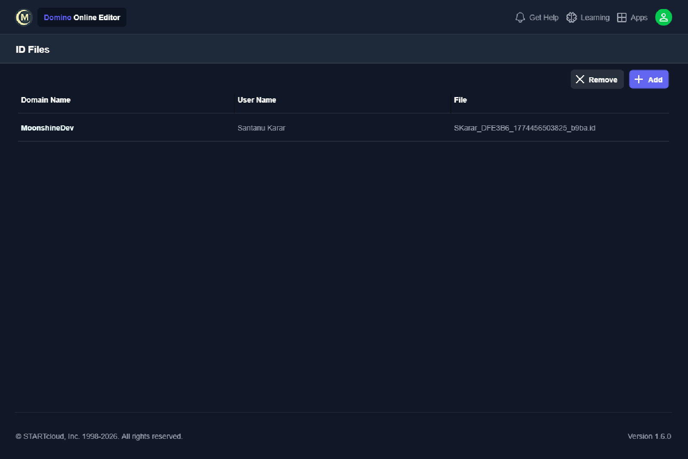

<!-- markdownlint-disable MD033 MD013 -->

## Nomad Services

{: .fs-9 }

**Cloud-Powered HCL Nomad Testing — In Seconds, Not Months.**
{: .fs-6 .fw-300 }

Instantly deploy, preview, and validate your Domino NSF applications in a fully managed HCL Nomad environment. No servers. No setup. No friction.
{: .fs-5 .fw-300 }

[Start Free](https://nomad-1.moonshine.team/Super.Human.Portal/js-release/index.html#/getting-started){: .btn .btn-primary .fs-5 .mb-4 .mb-md-0 .mr-2 }
[See the Platform](https://www.moonshine.dev/){: .btn .fs-5 .mb-4 .mb-md-0 }

---

  <h2 style="font-size: 2rem; color: #e0e0f0;">Accelerate Your Domino Modernization</h2>
  

    Legacy applications shouldn't hold your organization back. Nomad Services bridges the gap between your existing Domino investments and the modern, mobile-first experiences your users demand.
  

---

  

    <h3 style="color: #e8c547; margin-top: 0;">Zero Infrastructure</h3>
    
No servers to provision. No VPNs to configure. No IT tickets to file. Upload your NSF and go — your app is live on HCL Nomad in under 60 seconds.

  

  

    <h3 style="color: #e8c547; margin-top: 0;">Enterprise-Grade Cloud</h3>
    
Built on the <a href="https://moonshine.team">moonshine.team</a> infrastructure — a secure, scalable, cloud-native environment purpose-built for Domino workloads.

  

  

    <h3 style="color: #e8c547; margin-top: 0;">Cross-Platform, Mobile-First</h3>
    
See exactly how your application renders on desktop, tablet, and mobile. HCL Nomad delivers your Domino apps to <strong>every device</strong>, everywhere.

  

---

  <h2 style="font-size: 2rem; color: #e0e0f0;">How It Works</h2>
  
From NSF to live application in four simple steps

  

    
01

    <h4 style="color: #e0e0f0; margin: 0.5rem 0;">Upload</h4>
    
Drag and drop your NSF into the secure upload portal

  

  

    
02

    <h4 style="color: #e0e0f0; margin: 0.5rem 0;">Deploy</h4>
    
We instantly spin it up on HCL Nomad in the cloud

  

  

    
03

    <h4 style="color: #e0e0f0; margin: 0.5rem 0;">Preview</h4>
    
Test on desktop, tablet, and mobile — real devices, real results

  

  

    
04

    <h4 style="color: #e0e0f0; margin: 0.5rem 0;">Iterate</h4>
    
Refine, re-upload, and redeploy in seconds

  

---

  <h2 style="font-size: 2rem; color: #e8c547;">Domino Online Editor</h2>
  

    A complete <strong>browser-based environment</strong> for building, managing, and deploying Domino applications across your entire infrastructure. No Notes client required.
  

  

  

    
&#128187;

    <h4 style="color: #e0e0f0; margin: 0.5rem 0;">Agent Development</h4>
    
Create and edit <strong>LotusScript</strong>, <strong>Java</strong>, and <strong>Formula</strong> agents directly in your browser. Full syntax highlighting and debugging.

  

  

    
&#128451;

    <h4 style="color: #e0e0f0; margin: 0.5rem 0;">Database Management</h4>
    
Browse, manage, and edit Domino <strong>database elements</strong> online. Full CRUD operations without a desktop client.

  

  

    
&#127760;

    <h4 style="color: #e0e0f0; margin: 0.5rem 0;">Multi-Server Support</h4>
    
Connect to <strong>multiple Domino servers</strong> with a single ID file. Manage your entire infrastructure from one interface.

  

  

    
&#128260;

    <h4 style="color: #e0e0f0; margin: 0.5rem 0;">Version Control</h4>
    
Built-in <strong>backup and restore</strong> for design elements. Track changes and roll back with confidence.

  

  
Secure ID file management — connect to any Domino server from your browser

  

---

  <h2 style="font-size: 2rem; color: #e0e0f0;">Built for the Enterprise</h2>

  

    
&#9889;

    <h4 style="color: #e0e0f0;">Rapid Prototyping</h4>
    
Validate before you commit. Test modernization strategies in minutes, not quarters.

  

  

    
&#128274;

    <h4 style="color: #e0e0f0;">Secure by Design</h4>
    
Enterprise-grade security with ID file management. Your data stays protected in our managed cloud.

  

  

    
&#128268;

    <h4 style="color: #e0e0f0;">REST API Access</h4>
    
Full NoSQL database access via REST APIs. Integrate with modern toolchains and CI/CD workflows.

  

  

    
&#128640;

    <h4 style="color: #e0e0f0;">Digital Transformation</h4>
    
Bridge legacy Domino to modern mobile-first experiences without rewriting a single line of code.

  

---

  <h2 style="font-size: 2rem; color: #e0e0f0;">The Moonshine.dev Platform</h2>
  

    Nomad Services is part of a complete <strong>rapid application development</strong> ecosystem. Build, test, and deploy — all from one platform.
  

  <a href="https://app.moonshine.dev/public/file/serve/moonshine-dev-private/index.html" style="flex: 1; min-width: 220px; max-width: 270px; padding: 2rem 1.5rem; background: linear-gradient(135deg, rgba(108,92,231,0.12) 0%, rgba(168,85,247,0.06) 100%); border: 1px solid #2a2a4a; border-radius: 12px; text-decoration: none; transition: border-color 0.2s, transform 0.2s;" onmouseover="this.style.borderColor='#6c5ce7';this.style.transform='translateY(-2px)'" onmouseout="this.style.borderColor='#2a2a4a';this.style.transform='translateY(0)'">
    <h4 style="color: #e8c547; margin-top: 0;">Canvas Editor</h4>
    
Drag-and-drop <strong>WYSIWYG</strong> UI designer. Build mockups visually and deploy to any platform.

  </a>

  <a href="https://app.moonshine.dev/public/file/serve/form-builder/index.html" style="flex: 1; min-width: 220px; max-width: 270px; padding: 2rem 1.5rem; background: linear-gradient(135deg, rgba(108,92,231,0.12) 0%, rgba(168,85,247,0.06) 100%); border: 1px solid #2a2a4a; border-radius: 12px; text-decoration: none; transition: border-color 0.2s, transform 0.2s;" onmouseover="this.style.borderColor='#6c5ce7';this.style.transform='translateY(-2px)'" onmouseout="this.style.borderColor='#2a2a4a';this.style.transform='translateY(0)'">
    <h4 style="color: #e8c547; margin-top: 0;">Form Builder</h4>
    
<strong>Low-code</strong> form creation with built-in validation, fields, and components.

  </a>

  <a href="https://app.moonshine.dev/public/file/serve/moonshine-dev-private/assets/ai/index.html" style="flex: 1; min-width: 220px; max-width: 270px; padding: 2rem 1.5rem; background: linear-gradient(135deg, rgba(108,92,231,0.12) 0%, rgba(168,85,247,0.06) 100%); border: 1px solid #2a2a4a; border-radius: 12px; text-decoration: none; transition: border-color 0.2s, transform 0.2s;" onmouseover="this.style.borderColor='#6c5ce7';this.style.transform='translateY(-2px)'" onmouseout="this.style.borderColor='#2a2a4a';this.style.transform='translateY(0)'">
    <h4 style="color: #e8c547; margin-top: 0;">AI Tooling</h4>
    
Describe your UI in <strong>plain English</strong> and watch AI generate your mockup instantly.

  </a>

  <a href="https://app.moonshine.dev/public/file/serve/domino-integration/index.html" style="flex: 1; min-width: 220px; max-width: 270px; padding: 2rem 1.5rem; background: linear-gradient(135deg, rgba(108,92,231,0.12) 0%, rgba(168,85,247,0.06) 100%); border: 1px solid #2a2a4a; border-radius: 12px; text-decoration: none; transition: border-color 0.2s, transform 0.2s;" onmouseover="this.style.borderColor='#6c5ce7';this.style.transform='translateY(-2px)'" onmouseout="this.style.borderColor='#2a2a4a';this.style.transform='translateY(0)'">
    <h4 style="color: #e8c547; margin-top: 0;">Domino Integration</h4>
    
<strong>NoSQL database</strong> with REST API access and a complete web testing interface.

  </a>

---

  <h2 style="font-size: 2.2rem; color: #e8c547; margin-bottom: 1rem;">Ready to Modernize Your Domino Applications?</h2>
  

    Join organizations already using Nomad Services to accelerate their digital transformation. Get your NSF running in HCL Nomad today.
  

  <a href="https://nomad-1.moonshine.team/Super.Human.Portal/js-release/index.html#/getting-started" class="btn btn-primary fs-5" style="margin-right: 1rem;">Get Started Now</a>
  <a href="https://www.moonshine.dev/" class="btn fs-5">Contact Us</a>

<!-- markdownlint-enable MD033 MD013 -->
